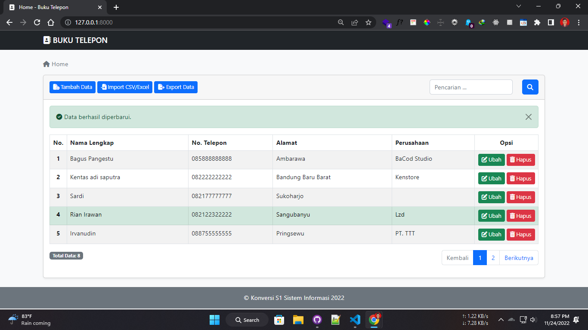

# ☎️ Buku Telepon

Aplikasi Web Buku Telepon sebagai tugas kuliah S1 Sistem Informasi ITBA DCC Pringsewu 2022 dengan Bahasa Pemrograman Python dan Framework Django.



> [Live Demo 1](https://bukutelepon.onrender.com) (Singapore) | [Live Demo 2](https://kelompok1-bukutelepon.up.railway.app) (US)

#### Software

[](https://www.python.org/downloads)
[](https://python-poetry.org/docs/#installation)

#### Framework

- Django v3.2.16

#### Database

- SQLite 3

#### Dependencies

| Nama       | Deskripsi                               |
| ---------- | --------------------------------------- |
| whitenoise | Membuka akses static file di server     |
| xlsxwriter | Membuat & export file xlsx              |
| pandas     | Membaca data import file                |
| xlrd       | Engine untuk membaca file xls           |
| openpyxl   | Engine untuk membaca file xlsx dan xlsm |
| pyxlsb     | Engine untuk membaca file xlsb          |

#### 🔥Download

```
git clone https://github.com/baguspangestu/Django_BukuTelepon.git
```

#### 1. Inisialisasi

```
poetry install
```

#### 2. Migrate

```
poetry run python manage.py migrate
```

#### 3. Run Server

```
poetry run python manage.py runserver
```

#### Sudah disetting untuk di deploy ke [render.com](https://render.com) & [railway.app](https://railway.app)

File Setting bluprint Render.com

> render.yaml

Untuk deploy ke Railway, tambahkan Environment Variable:

| Key    | Value |
| ------ | ----- |
| RENDER | True  |

---

[](LICENSE.md)
